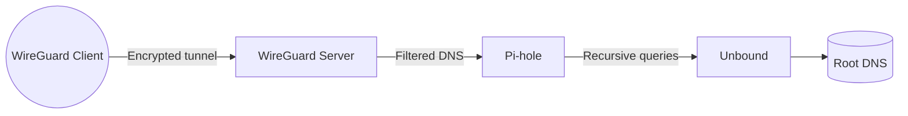

# SELO Privacy Stack


SELO Privacy Stack is an automated installer that transforms a Debian/Ubuntu host into a hardened, always-on privacy gateway. The stack combines three battle-tested components to deliver DNS-leak-proof browsing, network-wide ad/tracker blocking, and secure remote access:

- **Unbound** – validating, recursive DNS resolver.
- **Pi-hole** – network-wide ad and telemetry filter.
- **WireGuard** – modern VPN tunnel for remote clients or branch sites.

Run a single script and receive a fully configured private gateway with exportable WireGuard profiles and QR codes for mobile clients.

---

## Table of Contents

1. [Architecture](#architecture)
2. [Features](#features)
3. [Requirements](#requirements)
4. [Quick Start](#quick-start)
5. [Configuration Flags](#configuration-flags)
6. [Generated Assets](#generated-assets)
7. [Post-Install Checklist](#post-install-checklist)
8. [Managing WireGuard Clients](#managing-wireguard-clients)
9. [Pi-hole Administration](#pi-hole-administration)
10. [Troubleshooting](#troubleshooting)
11. [Roadmap](#roadmap)

---

## Architecture



All outbound DNS from VPN clients is intercepted by Pi-hole and resolved through Unbound, preventing DNS leaks and enforcing ad/tracker blocking.

## Features

- Automated provisioning of Unbound, Pi-hole, and WireGuard on Debian/Ubuntu.
- Zero-touch configuration: interface detection, secure password generation, QR codes.
- DNSSEC-ready Unbound configuration with hardened privacy defaults.
- Idempotent runs—safe to re-execute on the same host to update settings.
- Human-readable summary of credentials and connection details at completion.

## Requirements

- Debian- or Ubuntu-based host with Internet access and `apt` package manager.
- Root privileges (run via `sudo`).
- UDP port `51820` (default) reachable from the public Internet.
- Optional: static public IPv4 or dynamic DNS record for consistent client access.

## Quick Start

1. Clone this repository:
   ```bash
   git clone https://github.com/<your-org>/selo-privacy-stack.git
   cd selo-privacy-stack
   ```
2. Transfer the installer to the target host (if running remotely):
   ```bash
   scp scripts/install_privacystack.sh user@server:/tmp/
   ```
3. SSH into the server and execute the installer with root privileges:
   ```bash
   sudo bash /tmp/install_privacystack.sh \
     --server-ip 203.0.113.42 \
     --client-name laptop \
     --vpn-network 10.8.0.0/24
   ```

The script installs required packages, configures Unbound and Pi-hole, sets up WireGuard, enables IP forwarding and NAT, and generates client assets.

## Configuration Flags

| Flag | Default | Description |
| --- | --- | --- |
| `--server-ip` | _(detected)_ | Public IPv4 or hostname clients use to reach WireGuard. Auto-detected if omitted; prompts when detection fails. |
| `--pihole-password` | _(random)_ | Override the randomly generated Pi-hole admin password. Stored at `/root/.pihole_webpassword`. |
| `--vpn-interface` | `wg0` | WireGuard interface name. |
| `--vpn-port` | `51820` | UDP listen port for WireGuard. |
| `--vpn-network` | `10.8.0.0/24` | VPN CIDR. First usable address is assigned to the server. |
| `--client-name` | `client1` | Label for the first generated WireGuard client profile and QR code. |

## Generated Assets

- **Pi-hole Admin UI**: `http://<LAN-IP>/admin`
  - Credential file: `/root/.pihole_webpassword`.
- **WireGuard server config**: `/etc/wireguard/<interface>.conf`
- **Client profile**: `/etc/wireguard/clients/<client-name>.conf`
- **Client QR (ANSI)**: `/var/lib/privacy-stack/<client-name>.qr`

Display the QR code in the terminal:
```bash
cat /var/lib/privacy-stack/<client-name>.qr
```

## Post-Install Checklist

```bash
sudo systemctl status unbound
pihole status
sudo wg show
```

Run a DNS leak test (e.g., https://www.dnsleaktest.com/) from a connected client—only the server’s IP should appear.

## Managing WireGuard Clients

1. **Generate keys** for a new client:
   ```bash
   sudo wg genkey | sudo tee /etc/wireguard/clients/newclient.key | \
     sudo wg pubkey | sudo tee /etc/wireguard/clients/newclient.pub
   sudo wg genpsk | sudo tee /etc/wireguard/clients/newclient.psk
   ```
2. **Assign IP** inside the VPN subnet (e.g., `10.8.0.3/32`).
3. **Add peer** to `/etc/wireguard/<interface>.conf` and restart:
   ```bash
   sudo systemctl restart wg-quick@wg0
   ```
4. **Create client config** mirroring the server endpoint/port and `DNS = <server-vpn-ip>`.
5. Optionally generate a QR code:
   ```bash
   sudo qrencode -t ansiutf8 < /etc/wireguard/clients/newclient.conf |
     sudo tee /var/lib/privacy-stack/newclient.qr
   ```

For desktop clients (macOS/Windows/Linux), import the `.conf` file using the official WireGuard application. For mobile, scan the QR code with the iOS/Android WireGuard app.

## Pi-hole Administration

- Update blocklists, DHCP, and whitelists via the Pi-hole web UI.
- Refresh gravity lists: `pihole -g`.
- Restart DNS services after changes: `pihole restartdns`.
- Inspect logs at `/var/log/pihole.log` and `/var/log/pihole-FTL.log` for troubleshooting.

## Troubleshooting

- **Installer failed mid-run**: address the reported issue, then re-run the script—idempotent steps will skip already-configured components.
- **Clients connect but no Internet**: confirm IP forwarding is enabled (`sudo sysctl net.ipv4.ip_forward` should return `1`) and the `PostUp` NAT rules exist in `/etc/wireguard/<interface>.conf`.
- **Pi-hole DNS unresponsive**: restart services (`sudo systemctl restart unbound pihole-FTL`).
- **Public IP/hostname changed**: update the client `Endpoint` or regenerate configs with the new address.

## Roadmap

- Optional IPv6 tunnel support.
- Automated multi-client generation workflow.
- Integration with dynamic DNS providers for changing WAN IPs.

---

Need deeper automation or customizations? Extend `scripts/install_privacystack.sh` with new parameters, or open an issue describing the desired enhancement.
