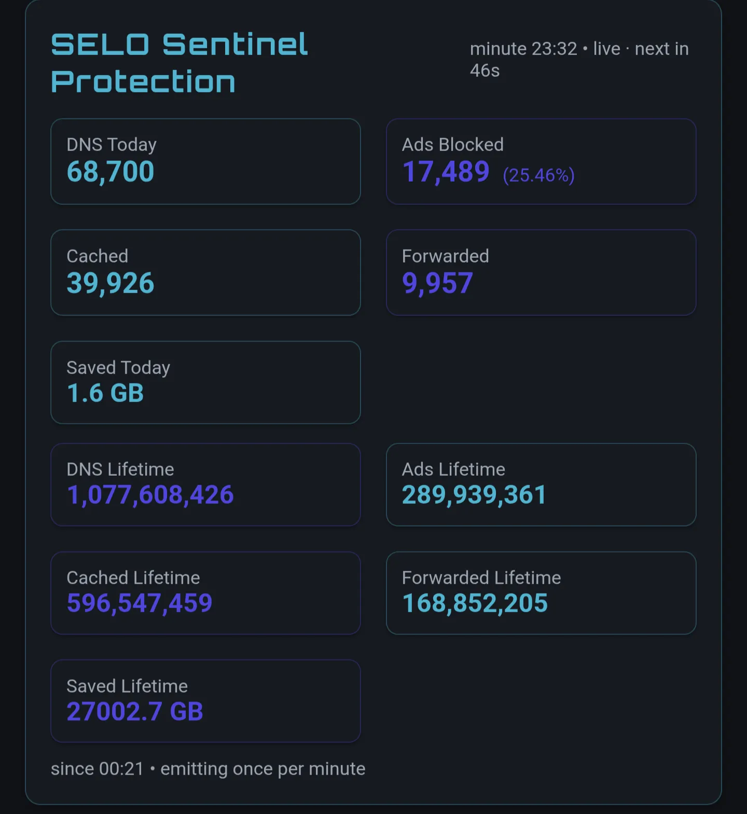
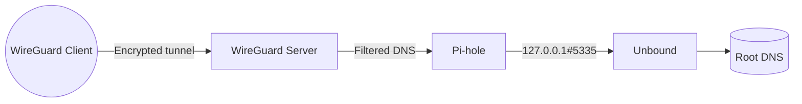

# SELO Privacy Stack


SELO Privacy Stack is an automated installer that transforms a Debian/Ubuntu host into a hardened, always-on privacy gateway. The stack combines three battle-tested components to deliver DNS-leak-proof browsing, network-wide ad/tracker blocking, and secure remote access:

- **Unbound** – validating, recursive DNS resolver.
- **Pi-hole** – network-wide ad and telemetry filter.
- **WireGuard** – modern VPN tunnel for remote clients or branch sites.

Run a single script and receive a fully configured private gateway with exportable WireGuard profiles and QR codes for mobile clients.

## Analytics

**5 months of protection across 11 devices (including mobile)**



---

## Table of Contents

1. [Architecture](#architecture)
2. [Features](#features)
3. [Requirements](#requirements)
4. [Quick Start](#quick-start)
5. [Configuration Flags](#configuration-flags)
6. [Re-running the Installer](#re-running-the-installer)
7. [Generated Assets](#generated-assets)
8. [Post-Install Checklist](#post-install-checklist)
9. [Managing WireGuard Clients](#managing-wireguard-clients)
10. [Pi-hole Administration](#pi-hole-administration)
11. [Blocklists](#blocklists)
12. [Troubleshooting](#troubleshooting)
13. [Roadmap](#roadmap)

---

## Architecture


```mermaid
flowchart LR
    Client((WireGuard Client)) -->|Encrypted tunnel| WG[WireGuard Server]
    WG -->|Filtered DNS| PI[Pi-hole]
    PI -->|127.0.0.1#5335| UB[Unbound]
    UB --> RootDNS[(Root DNS)]
```

All outbound DNS from VPN clients is intercepted by Pi-hole and resolved through Unbound, preventing DNS leaks and enforcing ad/tracker blocking.

Two details worth knowing, because they're easy to break:

- **Pi-hole listens in `LOCAL` mode**, which answers queries from any directly-attached subnet. That's what lets VPN peers on `wg0` use it. Binding Pi-hole to a single NIC silently kills DNS for every VPN client.
- **Unbound binds to `127.0.0.1:5335` only.** Pi-hole is its sole client. Nothing on the LAN talks to it directly.

### Split-horizon names

Local hostnames (`vault.selodev.com`, `git.selodev.com`, …) are served by **Pi-hole's own local DNS records**, not by Unbound. They never touch recursion, which is why Unbound's DNS-rebinding protection (`private-address`) doesn't interfere with them. If you ever move those records upstream, you'll need a matching `private-domain:` line in the Unbound config.

## Features

- Automated provisioning of Unbound, Pi-hole, and WireGuard on Debian/Ubuntu.
- Pi-hole **v6** aware (v5 still handled for older hosts).
- DNSSEC validation with RFC5011 automatic trust-anchor rollover.
- DNS rebinding protection — RFC1918 answers from public zones are dropped.
- Monthly `root.hints` refresh via a systemd timer.
- **Peer-safe re-runs:** an existing WireGuard server config is never rewritten; new clients are appended as peers.
- Live peer reload via `wg syncconf` — adding a client doesn't drop existing sessions.
- Zero-touch configuration: interface detection, secure password generation, QR codes.

## Requirements

- Debian- or Ubuntu-based host with Internet access and `apt` package manager.
- Root privileges (run via `sudo`).
- UDP port `51820` (default) reachable from the public Internet.
- If a host firewall is active (`ufw`, `firewalld`), it must allow that port. The installer **detects this and tells you the command**, but deliberately does not change firewall rules itself.
- Optional: static public IPv4 or dynamic DNS record for consistent client access.

## Quick Start

1. Clone this repository:
   ```bash
   git clone https://github.com/seloc0des/SentinelStack.git
   cd SentinelStack
   ```
2. Transfer the installer to the target host (if running remotely):
   ```bash
   scp scripts/install_privacystack.sh user@server:/tmp/
   ```
3. SSH into the server and execute the installer with root privileges:
   ```bash
   sudo bash /tmp/install_privacystack.sh \
     --server-ip 203.0.113.42 \
     --client-name laptop
   ```

The script installs required packages, configures Unbound and Pi-hole, sets up WireGuard, enables IP forwarding and NAT, and generates client assets.

## Configuration Flags

| Flag | Default | Description |
| --- | --- | --- |
| `--server-ip` | _(detected)_ | Public IPv4 or hostname clients use to reach WireGuard. Auto-detected if omitted; prompts when detection fails. |
| `--pihole-password` | _(random)_ | Override the randomly generated Pi-hole admin password. Stored at `/root/.pihole_webpassword`. |
| `--vpn-interface` | `wg0` | WireGuard interface name. |
| `--vpn-port` | `51820` | UDP listen port for WireGuard. |
| `--vpn-network` | `10.66.66.0/24` | VPN CIDR. First usable address is assigned to the server. |
| `--vpn-mtu` | `1340` | Interface MTU. 1340 survives most consumer links; raise it if your path allows. |
| `--client-name` | `client1` | Label for the generated WireGuard client profile and QR code. |
| `--policy-route-table` | `51821` | Numbered routing table used for VPN egress. |
| `--no-policy-routing` | _(off)_ | Skip the dedicated routing table and use the system default route. |
| `--force-server-config` | _(off)_ | **Destructive.** Regenerates the server `[Interface]` block and drops all existing peers. |

### Why the policy routing table?

If the host also runs another tunnel (a commercial VPN on `tun0`, say), that tunnel's default route would otherwise swallow your WireGuard clients' traffic. The installer puts VPN egress in its own routing table so clients always leave via the LAN gateway, regardless of what else is on the box. Pass `--no-policy-routing` on a host that doesn't need it.

## Re-running the Installer

Re-running is safe **by default**, but "safe" has a precise meaning here:

- The server `[Interface]` block and **all existing peers are preserved**.
- The named client is appended as a new peer, taking the next free address in the subnet.
- If the client's public key is already present, nothing is changed.
- Unbound and Pi-hole configs are backed up to `<file>.bak.<timestamp>.<pid>` before being rewritten.
- Peers are applied with `wg syncconf`, so connected devices stay connected. If a valid stripped config can't be built, the running interface is left untouched rather than risking a wipe.
- If Unbound fails validation or won't start, the previous config is restored automatically.
- The Pi-hole upstream is read back through the API after being set; the installer aborts rather than report success while Pi-hole might be bypassing Unbound.

> **`--force-server-config` is the exception.** It regenerates the server config from scratch and **drops every peer you have enrolled**. Don't reach for it unless you're rebuilding the gateway.

## Generated Assets

- **Pi-hole Admin UI**: `http://<LAN-IP>/admin`
  - Credential file: `/root/.pihole_webpassword` (mode `600`).
  - The password is no longer echoed to the terminal — read it with `sudo cat`.
- **WireGuard server config**: `/etc/wireguard/<interface>.conf`
- **Client profile**: `/etc/wireguard/clients/<client-name>.conf`
- **Client QR (ANSI)**: `/var/lib/privacy-stack/<client-name>.qr`

Display the QR code in the terminal:
```bash
cat /var/lib/privacy-stack/<client-name>.qr
```

## Post-Install Checklist

```bash
sudo systemctl status unbound
pihole status
sudo wg show
```

Confirm the chain is intact — Pi-hole must be resolving *through* Unbound, not around it:

```bash
# fresh domain via Pi-hole: expect ~100-200ms
dig @127.0.0.1 www.kernel.org | grep "Query time"
# same domain straight to Unbound: expect ~0ms, proving Pi-hole populated its cache
dig @127.0.0.1 -p 5335 www.kernel.org | grep "Query time"
```

Confirm DNSSEC is actually validating (not just enabled):

```bash
dig @127.0.0.1 -p 5335 dnssec.works +dnssec | grep RRSIG        # signed -> RRSIG present
dig @127.0.0.1 -p 5335 fail01.dnssec.works | grep status        # bogus  -> SERVFAIL
```

Run a DNS leak test (e.g., https://www.dnsleaktest.com/) from a connected client—only the server’s IP should appear.

## Managing WireGuard Clients

The easiest path is to re-run the installer with a new `--client-name`; it allocates the next free address and reloads without dropping anyone:

```bash
sudo bash install_privacystack.sh --client-name phone --server-ip 203.0.113.42
```

To do it by hand:

1. **Generate keys** for a new client:
   ```bash
   sudo wg genkey | sudo tee /etc/wireguard/clients/newclient.key | \
     sudo wg pubkey | sudo tee /etc/wireguard/clients/newclient.pub
   sudo wg genpsk | sudo tee /etc/wireguard/clients/newclient.psk
   ```
2. **Assign an IP** inside the VPN subnet (e.g., `10.66.66.5/32`).
3. **Add the peer** to `/etc/wireguard/<interface>.conf`, then apply it *without* a restart:
   ```bash
   sudo wg syncconf wg0 <(sudo wg-quick strip wg0)
   ```
   `systemctl restart wg-quick@wg0` also works, but it tears down every active session.
4. **Create the client config** mirroring the server endpoint/port with `DNS = <server-vpn-ip>`.
5. Optionally generate a QR code:
   ```bash
   sudo qrencode -t ansiutf8 < /etc/wireguard/clients/newclient.conf |
     sudo tee /var/lib/privacy-stack/newclient.qr
   ```

> **`SaveConfig` is deliberately `false`.** With it enabled, `wg-quick` rewrites the config file on shutdown and strips the `# client-name` comments that make the peer list readable. Leave it off.

### A note on IPv6

Client configs advertise `AllowedIPs = 0.0.0.0/0` only. IPv6 is intentionally left out: `wg0` has no IPv6 address and there is no `ip6tables` MASQUERADE rule, so advertising `::/0` would black-hole v6 traffic on dual-stack clients rather than tunnel it. Adding real IPv6 support is on the roadmap.

For desktop clients (macOS/Windows/Linux), import the `.conf` file using the official WireGuard application. For mobile, scan the QR code with the iOS/Android WireGuard app.

## Pi-hole Administration

Pi-hole **v6 removed the `pihole -a <subcommand>` interface.** Configuration now lives in `/etc/pihole/pihole.toml`, driven by `pihole-FTL --config`:

```bash
# v6
pihole setpassword '<NEW-PASSWORD>'
sudo pihole-FTL --config dns.upstreams '["127.0.0.1#5335"]'
sudo pihole-FTL --config dns.listeningMode 'LOCAL'
sudo pihole-FTL --config dns.dnssec false     # Unbound already validates
```

> `pihole-FTL --config dns.upstreams` prints `[]` even when upstreams *are* set — that's a display quirk of the CLI for array values, not a broken config. Read the real value with `pihole api config/dns/upstreams`.

Day-to-day:

- Update blocklists, DHCP, and whitelists via the Pi-hole web UI.
- Refresh gravity lists: `pihole -g`.
- Restart DNS services after changes: `pihole restartdns`.
- Inspect logs at `/var/log/pihole/pihole.log` and `/var/log/pihole/FTL.log`.
- Update components: `pihole -up`.

## Blocklists

The deployed stack runs a consolidated list plus a data-broker list — roughly **349,000 domains** in gravity:

- https://raw.githubusercontent.com/seloc0des/SELO-Block-List/main/seloblocklist.txt
- https://raw.githubusercontent.com/seloc0des/databrokerblocklist/refs/heads/main/lists/databroker.txt

If you'd rather assemble your own, these are solid sources:

- https://raw.githubusercontent.com/StevenBlack/hosts/master/hosts
- https://big.oisd.nl/
- https://v.firebog.net/hosts/AdguardDNS.txt

This system, these block lists and uBlock Origin Ad-blocker.
**Chef's Kiss**

## Troubleshooting

- **Installer failed mid-run**: address the reported issue, then re-run the script—existing peers and configs are preserved, and backups are written alongside each file it touches.
- **`pihole -a setdns` / `setinterface` not found**: you're on Pi-hole v6; see [Pi-hole Administration](#pi-hole-administration) for the replacements.
- **Clients connect but no Internet**: confirm IP forwarding is enabled (`sudo sysctl net.ipv4.ip_forward` should return `1`) and the `PostUp` NAT rules exist in `/etc/wireguard/<interface>.conf`.
- **VPN clients connect but DNS fails**: check Pi-hole's listening mode — it must be `LOCAL` (or `ALL`), not bound to a single interface.
   ```bash
   sudo pihole-FTL --config dns.listeningMode
   ```
- **Pi-hole DNS unresponsive**: restart services (`sudo systemctl restart unbound pihole-FTL`).
- **A local hostname stopped resolving after enabling rebind protection**: the name is resolving through public DNS to a private IP. Either move it into Pi-hole's local DNS records, or add `private-domain: "<zone>"` to `/etc/unbound/unbound.conf.d/pi-hole.conf`.
- **Duplicate iptables rules after reboots**: this stack no longer installs `iptables-persistent`. Its autosave combined with `PostUp` re-adding rules on every boot, stacking a fresh copy each time. `wg-quick` manages the rules itself now.
- **Client shows a handshake that never completes**: the host firewall is probably dropping the port. With `ufw`:
   ```bash
   sudo ufw status | grep 51820 || sudo ufw allow 51820/udp
   ```
- **Public IP/hostname changed**: update the client `Endpoint` or regenerate configs with the new address.

## Roadmap

- Optional IPv6 tunnel support (address on `wg0` + `ip6tables` MASQUERADE, then restore `::/0`).
- Automated multi-client generation workflow.
- Integration with dynamic DNS providers for changing WAN IPs.

---

Need deeper automation or customizations? Extend `scripts/install_privacystack.sh` with new parameters, or open an issue describing the desired enhancement.

Keep YOUR data PRIVATE and YOURS.
